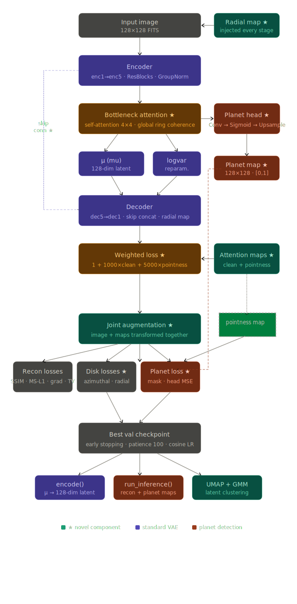
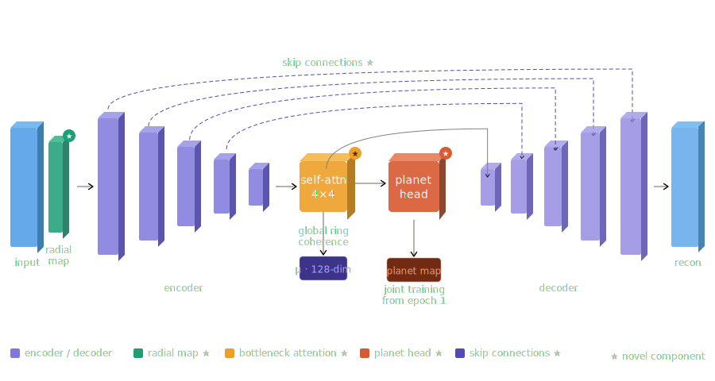
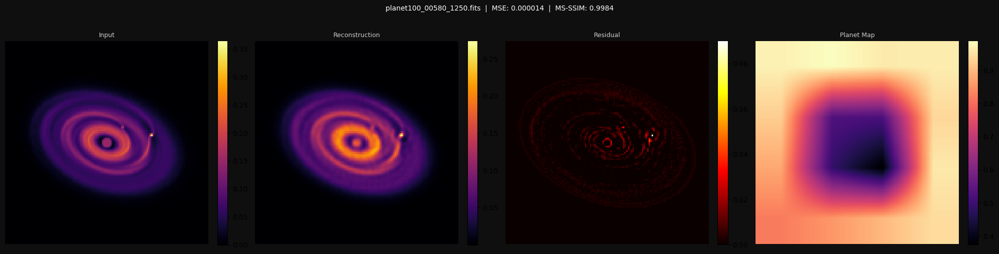
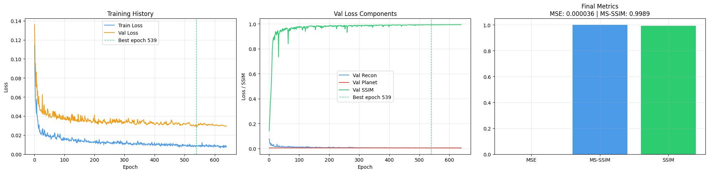

# GSoC 2026 | ML4Sci EXXA 

**Candidate:** Divyansh Soni  
**Target Project:** EXXA2  
**Status:** Completed (General Test + Image-Based Test)

---

## Overview

This repository contains the solutions for the **ML4Sci GSoC 2026** test tasks. The project focuses on applying physics-informed deep learning to analyze synthetic ALMA observations of protoplanetary disks,the birthplaces of planets.

The core contribution is **DiskVAE**, a specialized Variational Autoencoder designed to preserve the faint, fine-grained ring structures of protoplanetary disks that standard computer vision models often blur out. This model is key to the **Image-Based Test** (EXXA2), offering high-fidelity reconstruction and a structured latent space for scientific analysis.

---

## Repository Structure

```bash
gsoc-2026-exxa/
├── continuum_data_subset/            # Dataset (excluded from repo via .gitignore)
├── general_test/
│   ├── General_Test.ipynb            # [TASK 1] Unsupervised clustering pipeline
│   ├── general_test_pipeline_v2.svg  # Methodology diagram
│   └── clustermap.png                # Clustering visualization
│
├── image_task/
│   ├── Image_Test.ipynb              # [TASK 2] DiskVAE Model & Inference Pipeline
│   ├── diskvae_full_architecture3.svg # Model Architecture
│   ├── reconstructed_image.png       # Sample reconstruction
│   ├── resultplots.png               # Training metrics & performance
│   └── task2.pth                     # Pre-trained DiskVAE model weights
│
└── README.md                         # Documentation
```

---

## Task 1 : General Test
**Goal:** Unsupervised clustering of synthetic ALMA continuum observations to discover disk properties, particularly planet presence, without any labels.

Methodology

1. **Preprocessing** : Raw FITS frames are cleaned through NaN removal, arcsinh stretch, central star masking via local annulus median replacement, and normalization to [0, 1]. A radial profile subtraction step removes the smooth stellar brightness gradient, making the pipeline robust to bright planet spots that would otherwise bias the background model.
2. **Feature Extraction** : I trained a ring-aware Variational Autoencoder (DiskVAE) to compress each 128×128 disk image into a 128-dimensional latent vector. The architecture injects a normalized radial distance map at every stage, adds self-attention at the 4×4 bottleneck to enforce global ring coherence, and uses U-Net skip connections to preserve fine ring detail. The reconstruction target is a Gaussian-blurred version of the input , this deliberately erases planet signals, forcing the latent space to encode only smooth disk morphology.
3. **Planet Detection** : Because the VAE reconstructs disk background only, subtracting the reconstruction from the input produces a residual containing compact point-like sources. A LoG-based pipeline filters these peaks by compactness, contrast, core size, and ring contamination to produce planet candidate detections per image. Detections are used only for post-hoc analysis of cluster results, not during training or clustering.
4. **Clustering** : Latent vectors are first grouped by detected planet count (0, 1, 2+) as a primary partition. Within each group, PCA followed by GMM with BIC-selected k finds morphological subclusters. The full latent space is projected to 2D using UMAP for visualization.


#### Pipeline Diagram


#### Clustering Results

The UMAP projection shows each disk as a single point projected from 128 dimensions. Shape encodes planet count. Circles for 0 planets, squares for 1, triangles for 2 or more. Color and letter suffix indicate the GMM morphological subcluster within each group.
Show Image

## Conclusion
The UMAP projection reveals three broad morphological regions formed purely from the latent space, with no planet count information used during clustering. Overlaying the detected planet candidates shows that disk morphology and planetary features are not independent , there is a meaningful relationship between the two , but morphology alone is not a sufficient predictor of whether a planet is present. The central region shows heavy mixing across all three planet groups.
Two signals emerge with confidence at the extremes. The top-left region is strongly enriched in planet-free disks, while the bottom-right island contains predominantly disks hosting one or more planets. Disks falling in these extreme morphological regions carry a noticeably higher predictive signal, suggesting that certain structural features , localised brightness enhancements, ring asymmetries, or gap depths, are genuinely associated with planet formation activity, even if the full relationship cannot be captured by morphology alone.
The notebook `general_test/General_Test.ipynb` contains the full pipeline from raw FITS files to visualized clusters.

---
##  Task 2: Image-Based Test (Primary Focus for EXXA2)

**Goal:** Train an autoencoder to reconstruct protoplanetary disk images with an accessible latent space.

### The Solution: DiskVAE (Ring-Aware VAE)
Standard generic autoencoders struggle with the specific geometry of astronomical disks, often treating rings as noise or blurring them into a smooth gradient. **DiskVAE** introduces geometric priors directly into the architecture:

#### Architecture


1.  **Radial Conditioning:** Explicitly injects a polar coordinate grid into every layer, grounding the model in the physical reality of the disk's center-out structure.
2.  **Attention-Weighted Loss:** Uses pre-computed "Clean" (structure-only) and "Pointness" (planet-candidate) maps to weight the loss function locally.
    *   **Rings** get **1000x** validation signal.
    *   **Planet candidates** get **5000x** validation signal.
3.  **Joint Planet Head:** A specialized auxiliary head trained simultaneously to detect planet signatures from the latent bottleneck.
4.  **Bottleneck Self-Attention:** Ensures global coherence of rings (symmetry) across the image.

### Performance & Metrics
The model was evaluated on a held-out test set (20% split).

| Metric | Score | Note |
| :--- | :--- | :--- |
| **MSE** | **~0.00003** | Extremely low reconstruction error. |
| **MS-SSIM** | **~0.9989** | High structural similarity (captures rings/gaps). |
| **Latent Dim** | **128** | Dense, accessible latent space for analysis. |

#### Reconstruction Sample
Here is a sample reconstruction from the test set, showing the input, reconstruction, residual (difference), and planet probability map.


### Training Results

### Inference
To run inference on new data:
1.  Open `image_task/Image_Test.ipynb`.
2.  Use the `run_inference(folder_path)` function provided in the notebook.
3.  It returns reconstructions, latent vectors, and planet probability maps.

---
### Running the Notebooks
**Both notebooks are self-contained.**

1.  **Setup Data:** Place the `.fits` files in a folder named `continuum_data_subset/` in the root directory.
2.  **Run Image Task (EXXA2):**
    *   Navigate to `image_task/`.
    *   Run `Image_Test.ipynb`.
    *   Set `TRAIN_FROM_SCRATCH = False` to use the provided `task2.pth` weights.
3.  **Run General Task:**
    *   Navigate to `general_test/`.
    *   Run `General_Test.ipynb`.

