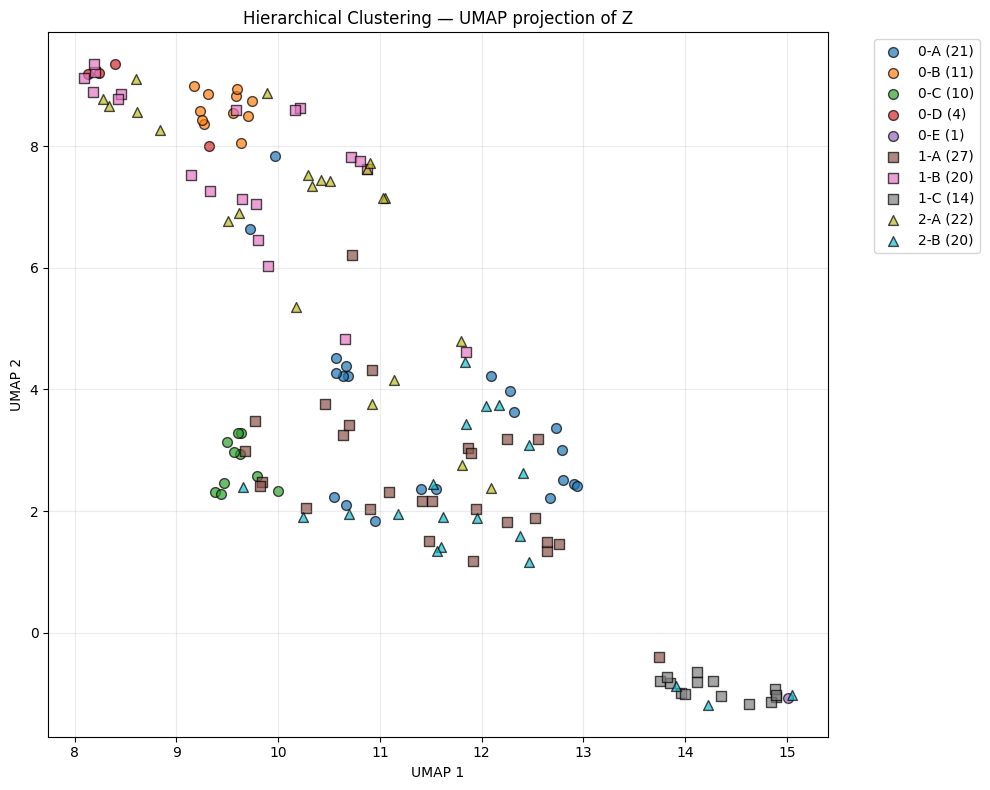

# ML4Sci GSoC 2026: Physics-Informed Deep Learning for Protoplanetary Disks

**Project:** ML4Sci - EXXA (Protoplanetary Disk Analysis)  
**Applicant:** Divyansh Soni  
**Tests Completed:** General Test (Unsupervised Clustering) + Image-Based Test (Ring-Aware Reconstruction)

---

##  Overview
This repository contains advanced machine learning pipelines designed to analyze synthetic ALMA observations of protoplanetary disks. As the birthplaces of planets, these disks are rich with faint structural details—gaps, rings, and potential protoplanets—that are often lost in standard deep learning pipelines. 

Unlike standard computer vision approaches, the models here are **physics-informed**. They incorporate geometric priors (radial symmetry), domain-specific attention mechanisms, and custom loss functions to detect faint planets and preserve fine ring structures that traditional autoencoders often blur out.

##  Key Innovations
| Feature | Standard Approach | My Approach (DiskVAE) |
| :--- | :--- | :--- |
| **Geometry Awareness** | CNNs treat disks like generic images | **Radial Conditioning:** Injects polar coordinate grids so the model understands "distance from center", preserving ring integrity. |
| **Loss Function** | MSE (blurry reconstructions) | **Attention-Weighted Loss:** Pre-computed "Clean" & "Pointness" maps force the model to focus on rings and planets (5000x weight). |
| **Planet Detection** | Latent space clustering | **Residual Analysis:** Trains the VAE to reconstruct the *background* disk; planets pop out clearly in the `Input - Reconstruction` residual. |
| **Global Coherence** | Convolutional local receptive fields | **Bottleneck Self-Attention:** Enforces symmetry and ring continuity across the entire image, preventing fragmented reconstructions. |

---

## 📂 Project Structure

```bash
gsoc-2026-exxa/
├── general_test/
│   ├── General_Test.ipynb            # MAIN: Unsupervised clustering & anomaly detection pipeline
│   ├── general_test_pipeline_v2.svg  # Pipeline architecture diagram
│   └── clustermap.png                # Clustering results visualization
│
├── image_task/
│   ├── Image_Test.ipynb              # MAIN: High-fidelity reconstruction & inference pipeline
│   ├── diskvae_full_architecture.svg # DiskVAE model architecture diagram
│   ├── resultplots.png               # Reconstruction comparisons
│   └── task2.pth                     # Pre-trained DiskVAE model weights (~130MB, handled via LFS)
│
├── continuum_data_subset/            # Dataset (excluded from repo)
├── sampletest/                       # Inference samples
└── README.md                         # Project documentation
```

---

##  Approach & Architectures

### 1. General Test: Unsupervised Clustering 
**Goal:** Group disks by morphology and automatically flag planet candidates without labels.

*   **Strategy:**
    1.  **Preprocessing:** Arcsinh stretch + Radial profile subtraction to normalize diverse flux ranges.
    2.  **Morphology VAE:** Trained on *blurred* targets to encode global shape (rings, inclination) into the latent space while deliberately ignoring point sources.
    3.  **Residual Analysis:** `Residual = Input - Reconstruction`. High-frequency anomalies in the residual are filtered via Laplacian of Gaussian (LoG) to identify planets.
    4.  **Hierarchical Clustering:** 
        *   **Level 1:** Group by detected planet count (0, 1, 2+).
        *   **Level 2:** GMM (Gaussian Mixture Models) on latent vectors to sub-cluster by ring structure.

.svg)

### 2. Image Task: Ring-Aware Reconstruction (DiskVAE)
**Goal:** Reconstruct disks with high fidelity, ensuring faint rings and planets are not lost to compression.

*   **Architecture:** Custom U-Net-like VAE with:
    *   **Radial Injection:** $(r, \theta)$ maps concatenated at every encoder/decoder block to enforce radial symmetry.
    *   **Joint Training:** A parallel "Planet Head" is trained to predict planet positions simultaneously with image reconstruction.
*   **Loss Engineering:** 
    *   `Weight = 1 + 1000*RingMap + 5000*PlanetMap`.
    *   Includes **MS-SSIM** (Multi-Scale Structural Similarity) and **Gradient Loss** for edge preservation.


---

##  Results & Performance

| Metric | Score (Test Set) | Significance |
| :--- | :--- | :--- |
| **MSE** | `2.86e-5` | Good pixel matching |
| **MS-SSIM** | `0.9852` | Captures structural similarity across multiple scales (fine rings vs global disk). |
| **SSIM** | `0.9856` | Excellent preservation of local contrast and luminance. |
| **Inference Time** | `<50ms` | Fast per-image encoding on standard GPU. |

### Visuals
**Reconstruction Quality:** Note how the faint planet (right) is preserved in the reconstruction and clearly visible in the planet map, unlike standard MSE-based models which would smooth it out.


**Clustering Map:**
Disks are automatically sorted by complexity (smooth vs. multi-ring) and planet presence.


---

## 🛠️ Quick Start

### Prerequisites
*   Python 3.8+
*   The project relies on standard scientific Python libraries along with `pytorch_msssim` for advanced loss functions.

### Installation
```bash
git clone https://github.com/divyanshmaybe/gsocMl4SCI.git
cd gsocMl4SCI
pip install torch torchvision astropy scikit-learn matplotlib pytorch_msssim tqdm ipywidgets
```

### Running the Notebooks
1.  **Image Task:** Open `image_task/Image_Test.ipynb`.
    *   Set `TRAIN_FROM_SCRATCH = False` to use the provided checkpoint.
    *   Run `run_inference([files])` to process new data.
2.  **General Test:** Open `general_test/General_Test.ipynb`.
    *   Run all cells to perform the full clustering pipeline on the `continuum_data_subset`.

---

## 🔮 Future Directions
1.  **Vision Transformers (ViT):** Replacing the convolutional bottleneck with ViT to capture long-range spiral arm dependencies.
2.  **Contrastive Learning (SimCLR):** For more robust rotation-invariant clustering without requiring explicit augmentations.
3.  **3D Parameter Retrieval:** Linking the VAE decoder to a physical radiative transfer model (like RADMC-3D) to regress dust mass and grain size directly.

---
**Contact:** Divyansh Soni  
**GitHub:** [divyanshmaybe](https://github.com/divyanshmaybe)
